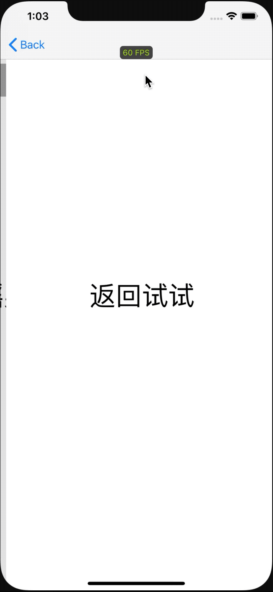

# CQDebugTool

[](https://travis-ci.org/luchunqing/CQDebugTool)
[](https://cocoapods.org/pods/CQDebugTool)
[](https://cocoapods.org/pods/CQDebugTool)
[](https://cocoapods.org/pods/CQDebugTool)

## 安装

```ruby
pod 'CQDebugTool'
```

## 部分功能说明
    1,显示FPS
    2,显示ViewController的释放
    3,日志显示，并支持日志搜索
    4,支持自定义功能

